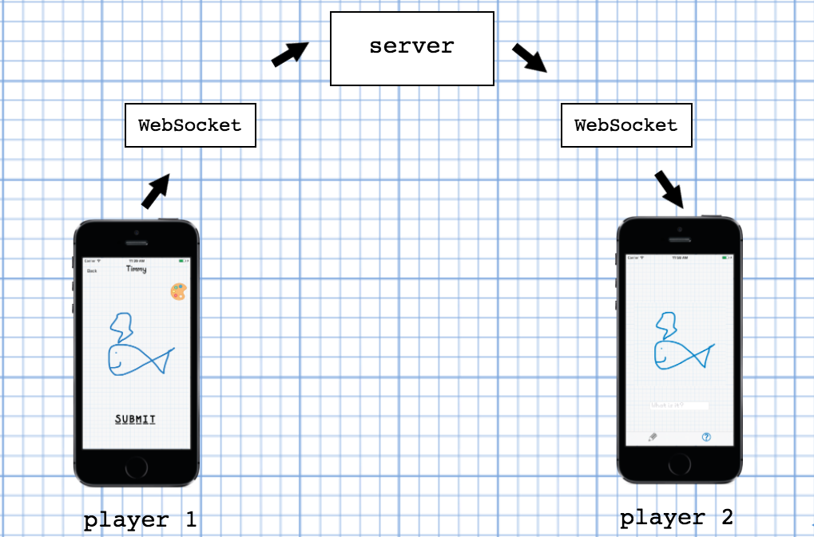

# Drawsome

Drawsome is realtime, multiplayer iOS drawing game! You can play as a "drawer", or a "guesser":
- As a drawer, you have 20 seconds to draw a random word of our (the game creators') choosing
- As a guesser, you receive drawers' drawings and must guess what word they were given to draw

## How it works

Check out a video demo of Drawsome:

[](https://www.youtube.com/watch?v=LcoMpC1xh1c)

Behind the scenes, this is how Drawsome works:



## User stories

```
As a User
So I have freedom in the game
I want to be able to choose to play as a "drawer" or a "guesser"
```
```
As a User
So I can submit drawings to be guessed
I want to be given a random word to draw when I play as a drawer
```
```
As a User
So I can express my creativity
I want to be able to select from different colors to draw with
```
```
As a User
So I can play Drawsome with my friends
I want to be able to broadcast my picture to other players
```
```
As a User
So I know if I guess a picture correctly
I want to receive a message letting me know if I am right or wrong
```

## Instructions
- clone the project into a local repository
- run ‘npm install’ in the nodeapp directory
- start the server in Terminal using ‘node draw-server.js’
- open drawApp.xcworkspace in Xcode
- ensure the 3 “IP ADDRESS” fields are updated to: 'http://[your machine’s private IP address]:3000'
- build the project on 2 devices from Xcode
- play Drawsome!
